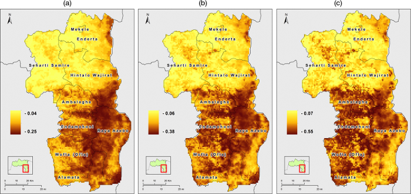

# Extreme Value Analysis on Gridded Data for the Estimation of Drought Risk

This repository contains the R scripts used to implement and apply extreme value statistical models to satellite-derived data 
in order to assess the extent of the areas prone to severe drought conditions. This repository is referenced in the following related published article:

Tonini, F., Jona Lasinio, G., and Hochmair, H. H. (2012). [Mapping return levels of absolute NDVI variations for the assessment of 
drought risk in Ethiopia](http://www.sciencedirect.com/science/article/pii/S0303243412000621?via%3Dihub). International Journal of Applied Earth Observation and Geoinformation, 18, pp. 564-572. 
DOI: http://dx.doi.org/10.1016/j.jag.2012.03.018

* [EV_RL.r](EV_RL.r): this script contains the algorithm used to estimate both the return levels 
  (for a number of desired return periods) and their confidence intervals pixel per pixel. 
  Also, the algorithm estimates the parameters of the extreme value distributions and their 
  confidence intervals using the Maximum Likelihood Estimator (MLE). 

* [EV_RP.r](EV_RP.r): this script contains the algorithm used to estimate the probability of exceedance
  (or return period, if you take the inverse) for some desired return level.
  Also, the algorithm estimates the parameters of the extreme value distributions and their 
  confidence intervals using the Maximum Likelihood Estimator (MLE). 

* [myEVfunctions.r](myEVfunctions.r): this script contains all the external modules called by the main scripts (either **EV_RL.r** 
  or **EV_RP.r**). Therefore, always place this file in the same folder with the main script.

**NOTE**: The algorithm was developed on our case study, thus it assumes that the input
dataset is formatted according to certain rules. We look forward to expand this repository 
by adding the code that could be used to read the native satellite image files and format
the spatiotemporal database accordingly. Also, we used the algorithm over monthly minima. Therefore,
you would need to manually adjust the code (looking at our comments throughout the code)
if you are using monthly maxima or, more in general, minima/maxima over a different time
frame such as year, season, etc.

## Credits and Contacts

Francesco Tonini: <ftonini84@gmail.com> 

## LICENSE

[Apache 2.0](LICENSE)
